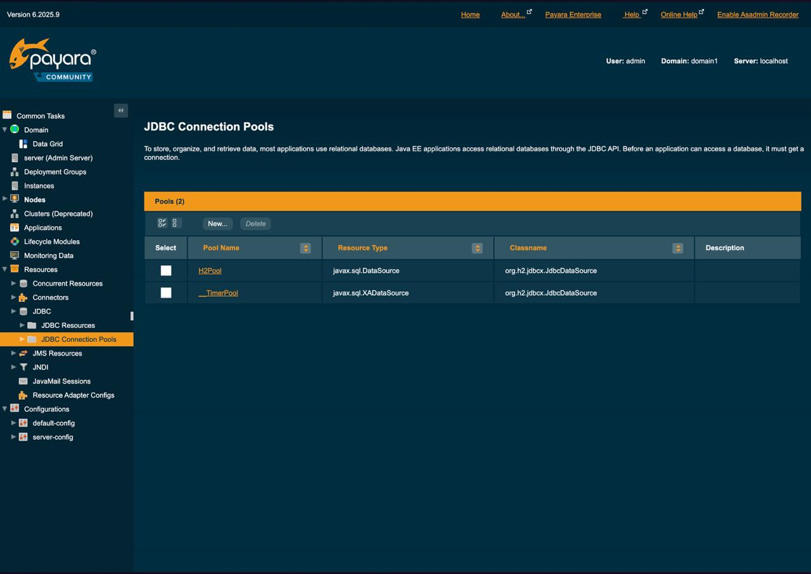
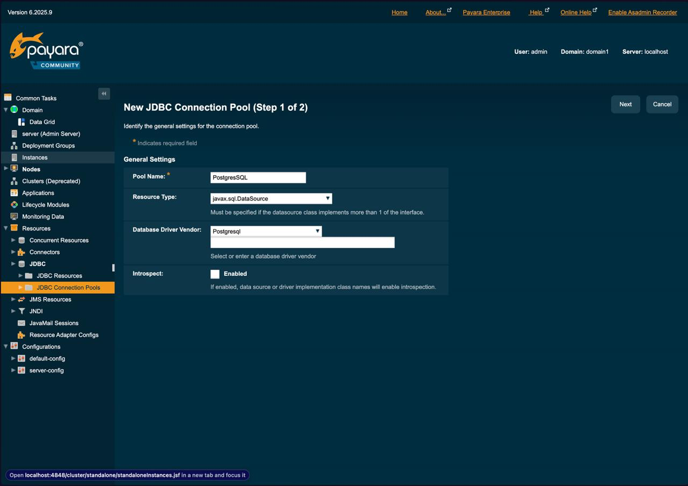
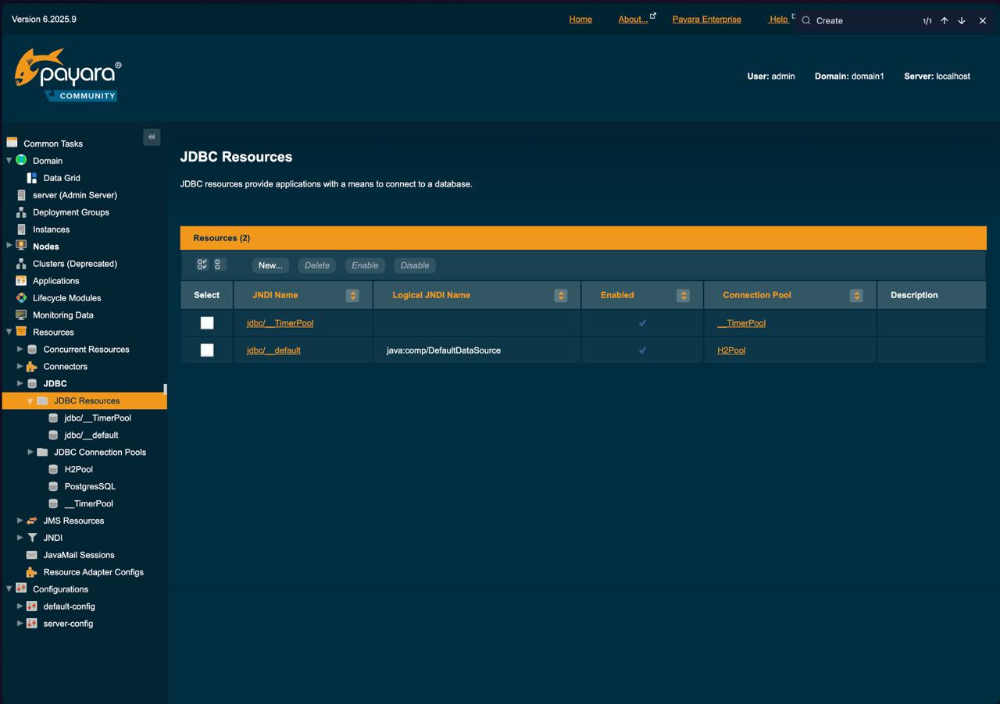
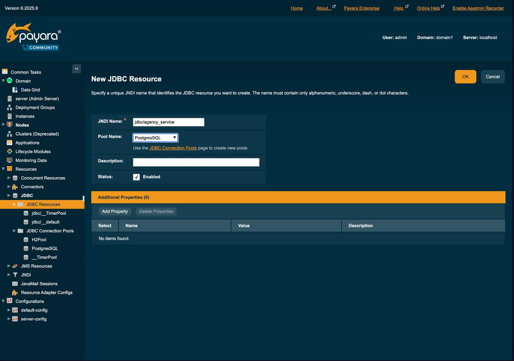

# Payara && Wildfly Installation&Deployment guide

## Payara for spring boot

p.s. apparently adopted(stolen) from article: https://dzone.com/articles/work-in-progress-1

1. Download zip and uncompress it. I will do it right in this folder
```bash
wget https://repo1.maven.org/maven2/fish/payara/distributions/payara/6.2025.9/payara-6.2025.9.zip
unzip payara-6.2025.9.zip
```

2. For start-deployment you can easily run this command(more command you can find in the make file in agency_service folder)
```bash
${PAYARA_HOME}/bin/asadmin start-domain domain1
```

3. For using postgresSQL you need to add jar to lib, for that download postgres:
```bash
wget https://repo1.maven.org/maven2/org/postgresql/postgresql/42.7.8/postgresql-42.7.8.jar
mv postgresql-42.7.8.jar $PAYARA_HOME/glassfish/lib
```

4. Try second point. If there an error, in most of the case problem is jdk. I advise use JDK-17 

5. Then go to the localhost:4848 and find Resources->JDBC->JDBC connection pool

6. Configure like on the screen

7. On the next step configure as you want, as for me, i changed only url, URL, User and Password
8. After you finish your configuration, you can find your database in the list and ping it.
9. Then find JDBC resources in the interface

10. Create new JDBC resource like this

---
That it with payara interface, then go to spring boot. I will use maven
1. First of all configure to package war and exclude tomcat
```xml
<packaging>war</packaging>
<dependency>
<groupId>org.springframework.boot</groupId>
<artifactId>spring-boot-starter-web</artifactId>
<exclusions>
    <exclusion>
        <groupId>org.springframework.boot</groupId>
        <artifactId>spring-boot-starter-tomcat</artifactId>
    </exclusion>
</exclusions>
</dependency>
```
2. Once we removed Tomcat, we cannot compile the code because of the missing Servlet API, so we need to provide Servlet API dependency in an explicit way
```xml
<dependency>
    <groupId>jakarta.servlet</groupId>
    <artifactId>jakarta.servlet-api</artifactId>
    <version>6.0.0</version>
    <scope>provided</scope>
</dependency>
```
3. We created JDBC resources and a connection pool. Now we need to say this to spring: 
```java
@Configuration
public class DataSourceConfigurer {

    private static final String JNDI = "jdbc/agency_service";

    @Bean(destroyMethod = "") // disable inference of a potential close() method as a destroyer
    public DataSource dataSource() throws DataSourceLookupFailureException {
        JndiDataSourceLookup dataSourceLookup = new JndiDataSourceLookup();
        return dataSourceLookup.getDataSource(JNDI);
    }
}
```
4. Now we configure almost everything, so let's create model and repository for test
Model
```java
@Entity
@Data
public class Model {
    @Id
    private Long id;
    private String name;
}
```
Repository
```java
@Repository
public interface ModelRepository extends JpaRepository<Model, Long> {}
```
Rest controller
```java
@RestController
@AllArgsConstructor
public class SimpleRestController {
    private ModelRepository modelRepository;
    @GetMapping("/data")
    public String data() {
        var m = new Model();
        m.setName("hate payara");
        modelRepository.save(m);
        return "hello world";
    }
}
```

7. And to finish, we need to configure only our Main class
```java
@SpringBootApplication
public class AgencyServiceApplication extends SpringBootServletInitializer {

    public static void main(String[] args) {
        SpringApplication.run(AgencyServiceApplication.class, args);
    }

    @Override
    protected SpringApplicationBuilder configure(SpringApplicationBuilder application) {
        return application.sources(AgencyServiceApplication.class);
    }
}
```
8. Do not forget add to we agency_service/src/main/webapp
bean.xml
```xml
<?xml version="1.0" encoding="UTF-8"?>
<beans xmlns="https://jakarta.ee/xml/ns/jakartaee"
       xmlns:xsi="http://www.w3.org/2001/XMLSchema-instance"
       xsi:schemaLocation="https://jakarta.ee/xml/ns/jakartaee
       https://jakarta.ee/xml/ns/jakartaee/beans_3_0.xsd"
       version="3.0"
       bean-discovery-mode="annotated">
    <scan>
        <exclude name="org.springframework.data.jpa.repository.cdi.**"/>
    </scan>
</beans>
```
glassfish-web.xml
```xml
<?xml version="1.0" encoding="UTF-8"?>
<!DOCTYPE glassfish-web-app PUBLIC "-//GlassFish.org//DTD GlassFish Application Server 3.1 Servlet 3.0//EN" "http://glassfish.org/dtds/glassfish-web-app_3_0-1.dtd">
<glassfish-web-app error-url="">
    <class-loader delegate="true"/>
    <jsp-config>
        <property name="keepgenerated" value="true">
            <description>Keep a copy of the generated servlet class' java code.</description>
        </property>
    </jsp-config>

    <!-- set a friendly context root -->
    <context-root>/agency</context-root>

    <!-- Change the default character encoding from ISO-8859-1 to UTF-8 -->
    <parameter-encoding default-charset="UTF-8"/>
</glassfish-web-app>
```
web.xml
```xml
<?xml version="1.0" encoding="UTF-8"?>
<web-app metadata-complete="true"
         xmlns="http://xmlns.jcp.org/xml/ns/javaee"
         xmlns:xsi="http://www.w3.org/2001/XMLSchema-instance"
         xsi:schemaLocation="http://xmlns.jcp.org/xml/ns/javaee
     http://xmlns.jcp.org/xml/ns/javaee/web-app_3_1.xsd"
         version="3.1">
</web-app>
```
Now you can easily ping my application by this: 
```bash
curl http://localhost:8080/agency/data 
```

P.S. you can try to install for idea debugger, but the biggest problem that glassfish for IDEa works only for jdk8, and payara ultimate tools working only with payara 5, so for the six version plain old debugging via prints:D
[link to official guide](https://docs.payara.fish/community/docs/Technical%20Documentation/Ecosystem/IDE%20Integration/IntelliJ%20Plugin/Payara%20Server.html)


---
# Widlfly for spring boot
1. Download wildfly
```bash
wget https://github.com/wildfly/wildfly/releases/download/37.0.1.Final/wildfly-37.0.1.Final.zip
unzip wildfly-37.0.1.Final.zip
```

2. Then 